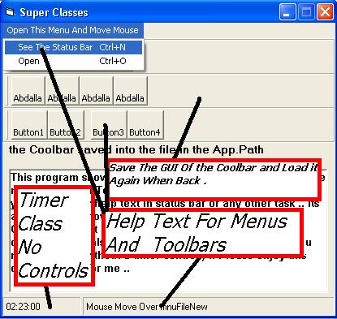



## Super Classes \( Very Important \)

### Description

Very impornat classes .. By these you will be able to Make Help Text for menus and toolbars by the MouseMove and MouseOut Events ( they dont have these Events ) .. and You will also be able to save the GUI of the MS Coolbar control .. This also have the Timer Class ( Timer Without Timer Control ) .. Please vote For Me ..
 
### More Info
 

             |
---                |---
**Submitted On**   |2003-07-06 18:46:36
**By**             |[Abdalla Mahmoud](https://github.com/Planet-Source-Code/PSCIndex/blob/master/ByAuthor/abdalla-mahmoud.md)
**Level**          |Intermediate
**User Rating**    |4.5 (18 globes from 4 users)
**Compatibility**  |VB 6\.0
**Category**       |[Windows System Services](https://github.com/Planet-Source-Code/PSCIndex/blob/master/ByCategory/windows-system-services__1-35.md)
**World**          |[Visual Basic](https://github.com/Planet-Source-Code/PSCIndex/blob/master/ByWorld/visual-basic.md)
**Archive File**   |[Super\_Clas161092762003\.zip](https://github.com/Planet-Source-Code/abdalla-mahmoud-super-classes-very-important__1-46702/archive/master.zip)

